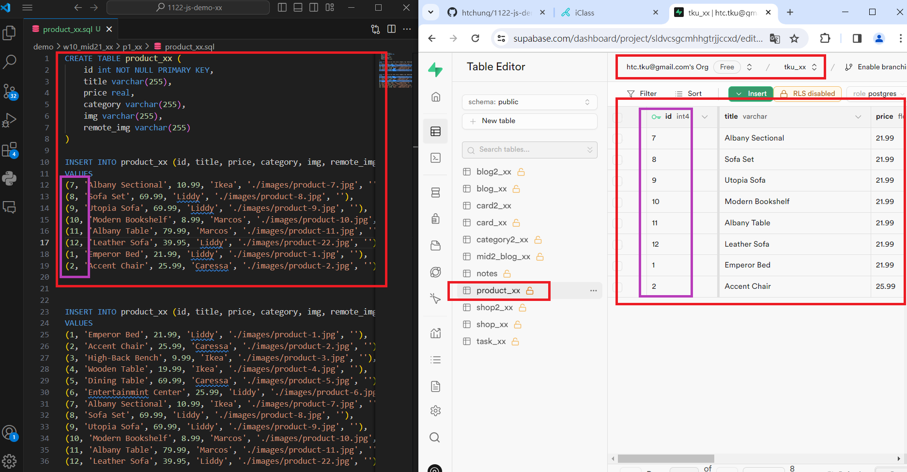
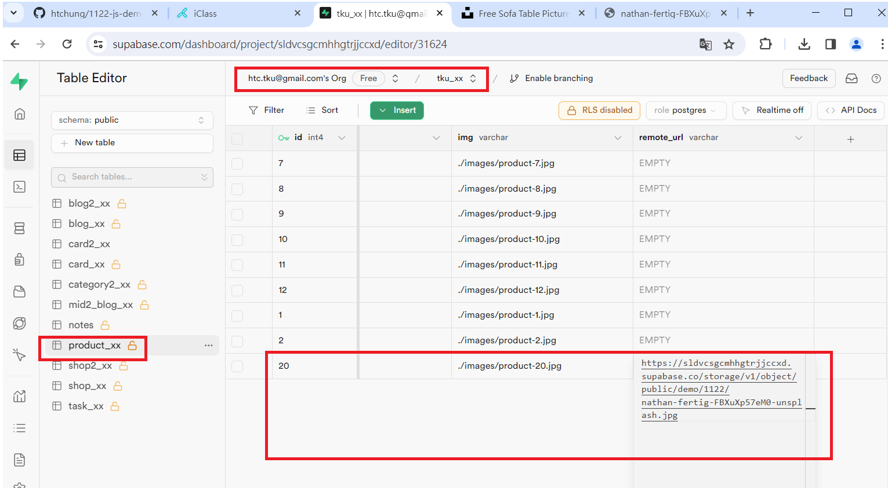
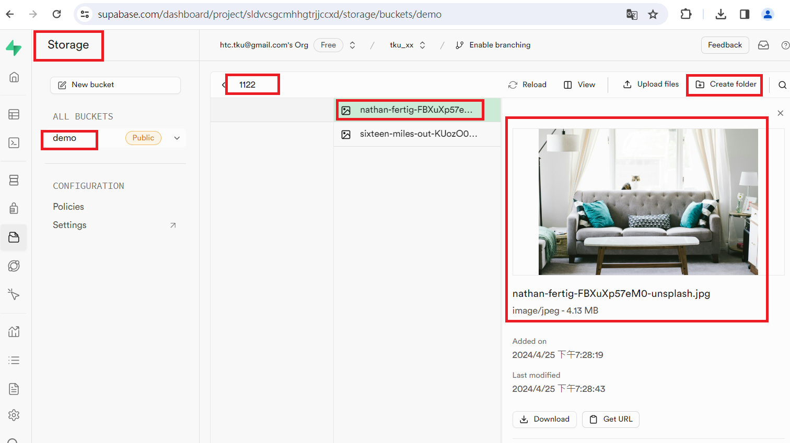
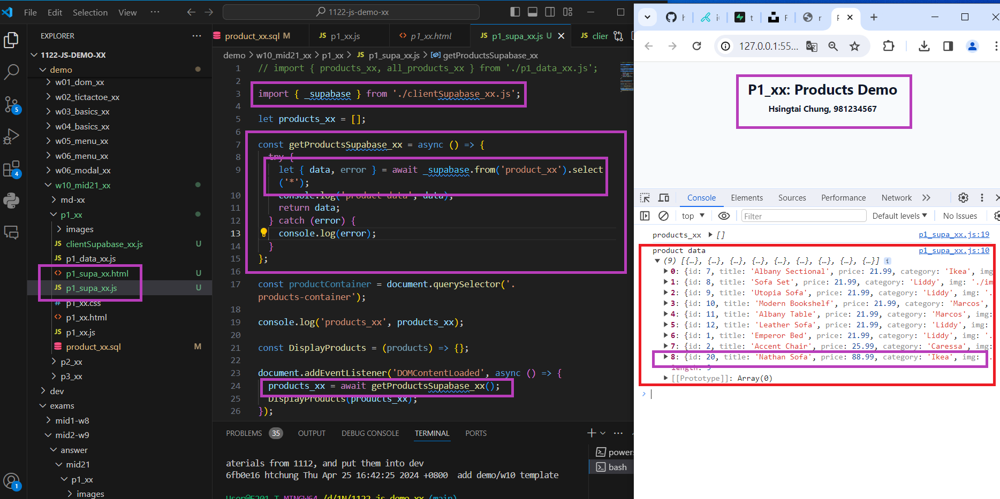
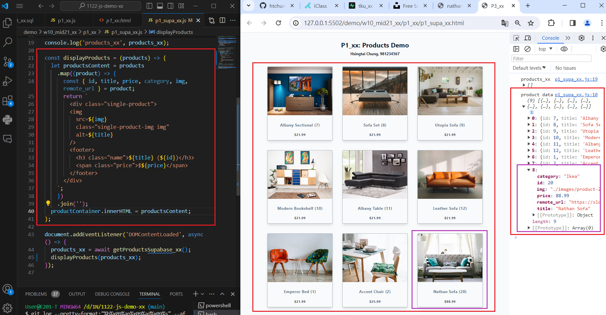

[My Github URL](https://github.com/Sky00l/1112-js-demo_90.git)
 
### ### W10-P1: In Supabase, create product_xx table with 8 product data
 


```
$ git log --pretty=format:"%h%x09%an%x09%ad%x09%s" --after="2024-06-05"
0115e51 Sky00l  Thu Feb 29 19:02:34 2024 +0800  W02-P1: Show Tictactoe css

```

### W10-P2: Get a photo from unsplash, and put it into storage in Supabase
 

 

 


```
$ git log --pretty=format:"%h%x09%an%x09%ad%x09%s" --after="2024-06-05"
0115e51 Sky00l  Thu Feb 29 19:02:34 2024 +0800  W02-P1: Show Tictactoe css

```
 
### W10-P3: Get 9 products data from Supabase, and show in console
 



```
$ git log --pretty=format:"%h%x09%an%x09%ad%x09%s" --after="2024-06-05"
0115e51 Sky00l  Thu Feb 29 19:02:34 2024 +0800  W02-P1: Show Tictactoe css

```

### W10-P4: Show products retrieved from Supabase
 


```
$ git log --pretty=format:"%h%x09%an%x09%ad%x09%s" --after="2024-06-05"
0115e51 Sky00l  Thu Feb 29 19:02:34 2024 +0800  W02-P1: Show Tictactoe css

```


### W06-P6: git logs for W6