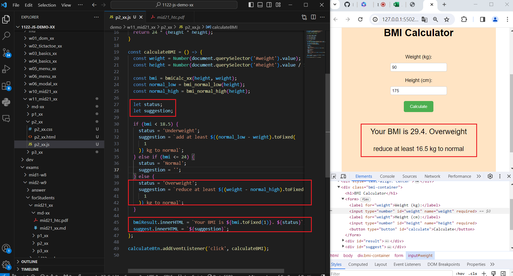
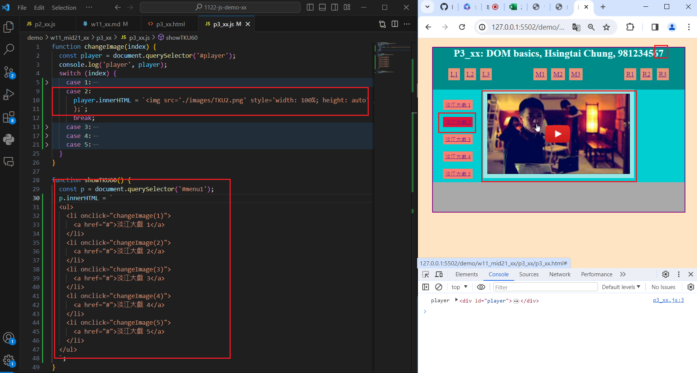
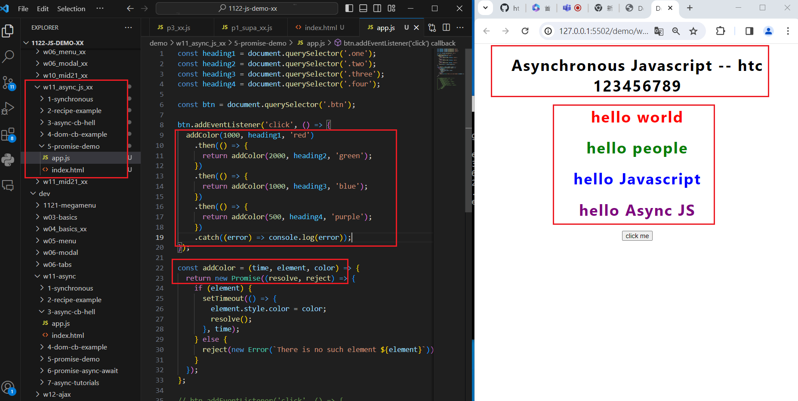
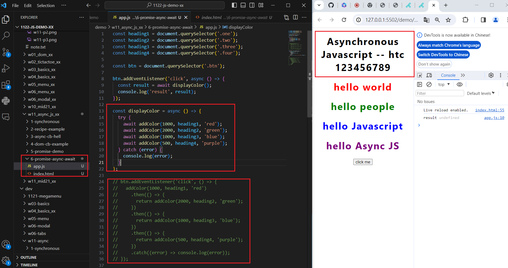

[My Github URL](https://github.com/Sky00l/1112-js-demo_90.git)
 
### W11-P1: Answer p2_xx in mid21
 


```
$ git log --pretty=format:"%h%x09%an%x09%ad%x09%s" --after="2024-06-12"
6a2652a Sky00l  Thu Jun 13 09:06:52 2024 +0800  W10-P1: In Supabase, create product_xx table with 8 product data

```

### W11-P2: Answer p3_xx in mid21
 


```
$ git log --pretty=format:"%h%x09%an%x09%ad%x09%s" --after="2024-06-12"
6a0b944 Sky00l  Thu Jun 13 09:09:57 2024 +0800  W10-P2: Get a photo from unsplash, and put it into storage in Supabase

```
 
###  W11-P3: Answer for '5-prommise-demo'



```
$ git log --pretty=format:"%h%x09%an%x09%ad%x09%s" --after="2024-06-12"
81a4ef Sky00l  Thu Jun 13 09:11:39 2024 +0800  W10-P3: Get 9 products data from Supabase, and show in console
```

### W11-P4: Answer for '6-prommise-async-await'
 


```
$ git log --pretty=format:"%h%x09%an%x09%ad%x09%s" --after="2024-06-12"
945e474 Sky00l  Thu Jun 13 09:12:35 2024 +0800  W10-P4: Show products retrieved from Supabase

```


### W11-P5: git logs for W11
 
```
git log --pretty=format:"%h%x09%an%x09%ad%x09%s" --after="2024-06-12"
945e474 Sky00l  Thu Jun 13 09:12:35 2024 +0800  W10-P4: Show products retrieved from Supabase
581a4ef Sky00l  Thu Jun 13 09:11:39 2024 +0800  W10-P3: Get 9 products data from Supabase, and show in console    
6a0b944 Sky00l  Thu Jun 13 09:09:57 2024 +0800  W10-P2: Get a photo from unsplash, and put it into storage in Supabase
6a2652a Sky00l  Thu Jun 13 09:06:52 2024 +0800  W10-P1: In Supabase, create product_xx table with 8 product data 
```