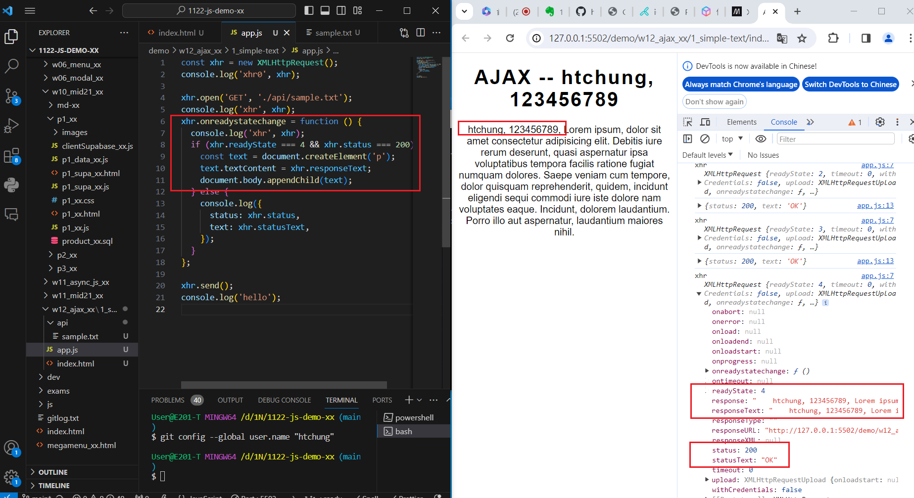
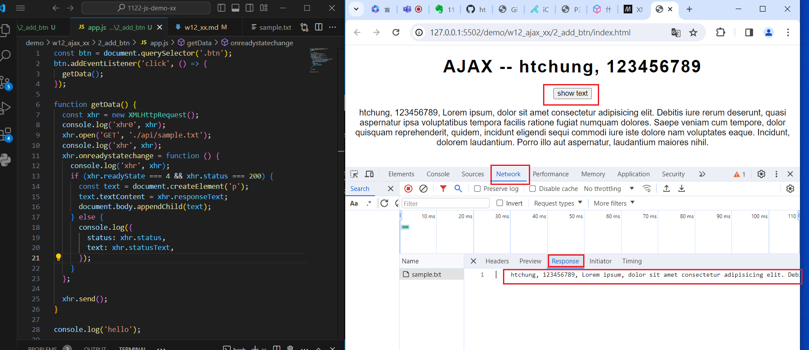
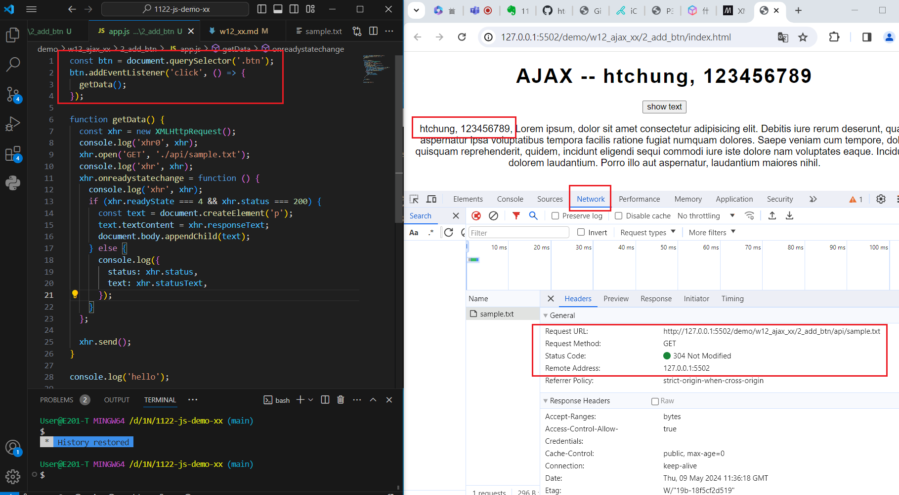
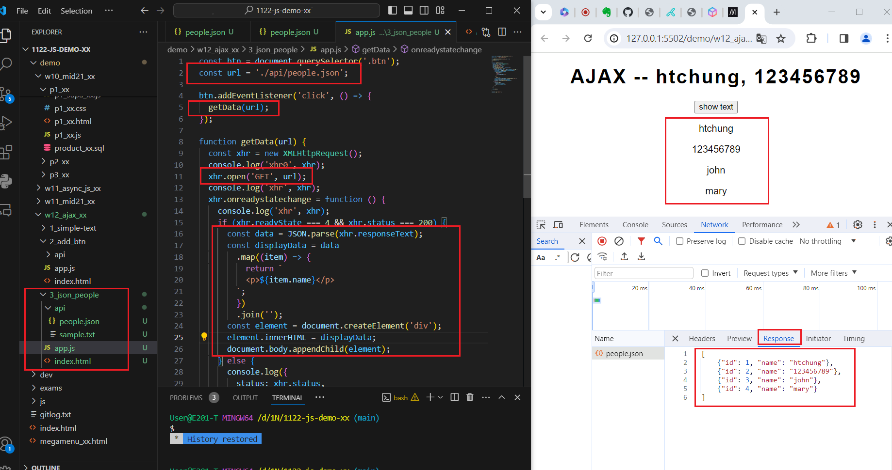

[My Github URL](https://github.com/Sky00l/1112-js-demo_90.git)
 
### W12-P1: Do 1_simple-text
 


```
$ git log --pretty=format:"%h%x09%an%x09%ad%x09%s" --after="2024-06-12"
88b556f Sky00l  Thu Jun 13 09:23:38 2024 +0800  W11-P1: Answer p2_xx in mid21

```

### W12-P2: Do 2_add_btn
 
#### => Network, Header
 

 
#### => Network, Response
 


```
$ git log --pretty=format:"%h%x09%an%x09%ad%x09%s" --after="2024-06-12"
740a231 Sky00l  Thu Jun 13 09:25:21 2024 +0800  W11-P2: Answer p3_xx in mid21
```
 
### W12-P3: Do 3_json_people_xhr
 

 

```
$ git log --pretty=format:"%h%x09%an%x09%ad%x09%s" --after="2024-06-12"
4bcfb0e Sky00l  Thu Jun 13 09:29:17 2024 +0800  W11-P3: Answer for '5-prommise-demo'  
```

### W11-P4: Answer for '6-prommise-async-await'
 


```
$ git log --pretty=format:"%h%x09%an%x09%ad%x09%s" --after="2024-06-12"
31e2b23 Sky00l  Thu Jun 13 09:31:50 2024 +0800  W11-P4: Answer for '6-prommise-async-await'
```

### W11-P5: git logs for W11
 
```
git log --pretty=format:"%h%x09%an%x09%ad%x09%s" --after="2024-06-12"
31e2b23 Sky00l  Thu Jun 13 09:31:50 2024 +0800  W11-P4: Answer for '6-prommise-async-await'
4bcfb0e Sky00l  Thu Jun 13 09:29:17 2024 +0800  W11-P3: Answer for '5-prommise-demo'       
740a231 Sky00l  Thu Jun 13 09:25:21 2024 +0800  W11-P2: Answer p3_xx in mid21
88b556f Sky00l  Thu Jun 13 09:23:38 2024 +0800  W11-P1: Answer p2_xx in mid21
```