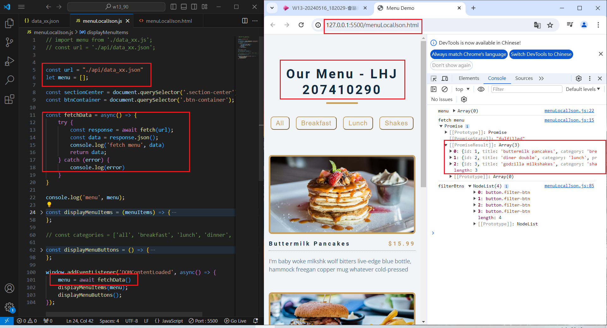

[My Github URL](https://github.com/Sky00l/1112-js-demo_90.git)
 
 ### W13-P1: Get 3 menu data from /api/data_xx.json
 


```
$ git log --pretty=format:"%h%x09%an%x09%ad%x09%s" --after="2024-06-05"
0115e51 Sky00l  Thu Feb 29 19:02:34 2024 +0800  W02-P1: Show Tictactoe css

```

### W06-P2: Display Menu buttons from categories array
 


 ### W06-P3: implement filter buttons
 
#### => choose breakfast
 

 
#### => choose shakes
 


 
#### => choose all
 


### W06-P4: implement open modals
 


### W06-P5: implement close modals
 


### W06-P6: git logs for W6