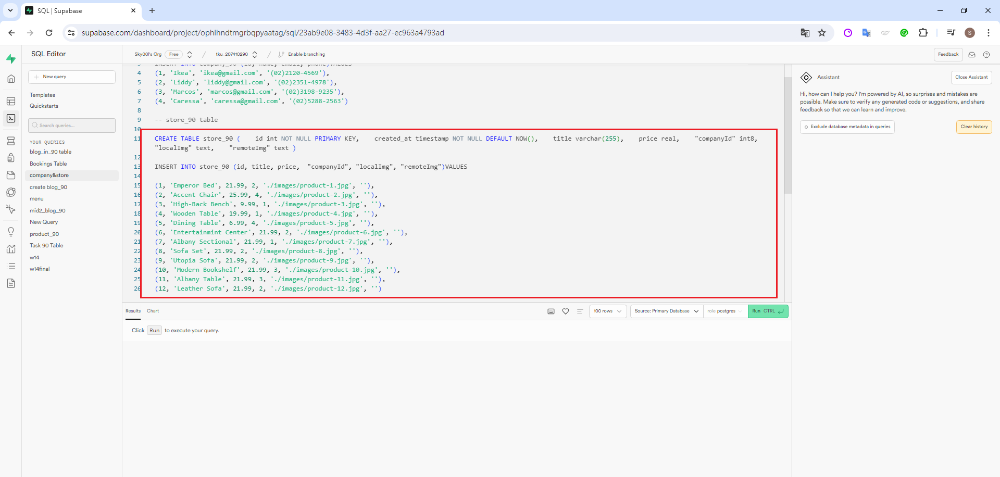

[My Github URL](https://github.com/Sky00l/1112-js-demo_90.git)
 
### W14-P1: Do products_api_xx.js to get data from an api url
 

 


```
$ git log --pretty=format:"%h%x09%an%x09%ad%x09%s" --after="2024-06-05"
0115e51 Sky00l  Thu Feb 29 19:02:34 2024 +0800  W02-P1: Show Tictactoe css

```

### W14-P2: Do products_localJson_xx.js to get local json data (/api/productsData.json)
 


```
$ git log --pretty=format:"%h%x09%an%x09%ad%x09%s" --after="2024-06-05"
e9eae8d Sky00l  Thu Jun 13 12:25:17 2024 +0800  W14-P2: Do products_localJson_xx.js to get local json data (/api/productsData.json)

```

### W14-P3: Use SQL to create schemas and data for company_xx and products_xx
 
#### => company_xx schema and data
 

 

 
#### => products_xx schema and data
 

 


```
$ git log --pretty=format:"%h%x09%an%x09%ad%x09%s" --after="2024-06-05"
ad36c93 Sky00l  Thu Jun 13 13:02:27 2024 +0800   W14-P3: Use SQL to create schemas and data for company_xx and products_xx

```

### W14-P4: Do products_supa_xx.js to get data from Supabase
 


```
$ git log --pretty=format:"%h%x09%an%x09%ad%x09%s" --after="2024-06-05"
14f6388 Sky00l  Thu Jun 13 13:11:27 2024 +0800  W14-P4: Do products_supa_xx.js to get data from Supabase  

```

### ### W15-P5:  Git logs for W15

```
git log --pretty=format:"%h%x09%an%x09%ad%x09%s" --after="2024-06-05"
14f6388 Sky00l  Thu Jun 13 13:11:27 2024 +0800  W14-P4: Do products_supa_xx.js to get data from Supabase  
ad36c93 Sky00l  Thu Jun 13 13:02:27 2024 +0800   W14-P3: Use SQL to create schemas and data for company_xx and products_xx
e9eae8d Sky00l  Thu Jun 13 12:25:17 2024 +0800  W14-P2: Do products_localJson_xx.js to get local json data (/api/productsData.json)
2fd4a8f Sky00l  Thu Jun 13 12:24:28 2024 +0800  W14-P1: Do products_api_xx.js to get data from an api url 
755e18f Sky00l  Thu Jun 13 12:03:23 2024 +0800  upload demo
```

